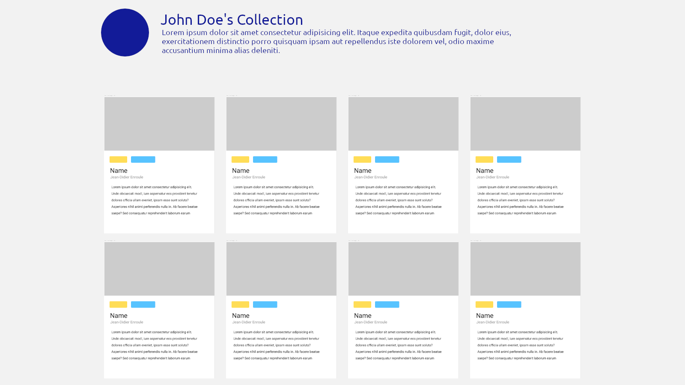
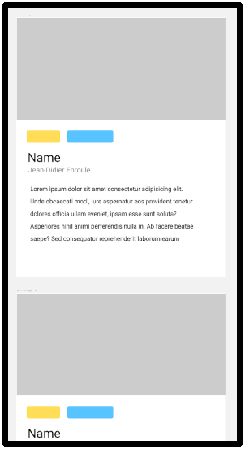
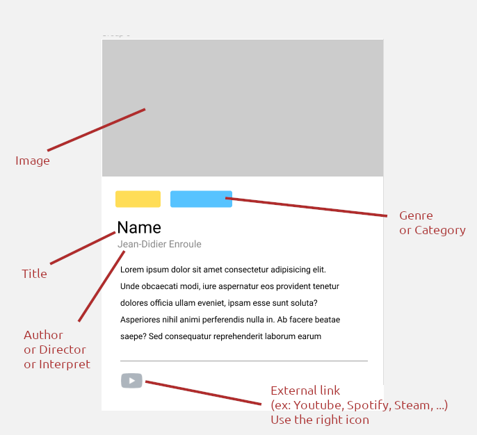

# The Collection

The Collection is a project I completed as part of the Software Development course at BeCode towards the beginning of my learning journey.  
Below, you’ll find the original instructions for the assignment, followed by a screenshot of the project I developed.

## The challenge

The goal of this project will be to summarize our current knowledge of :

- HTML and CSS
- Javascript Basics
- The DOM
- Responsive design

To create a collection of items.
This project will be split up in two parts.

---

### What are we going to craft?

Especially since the Covid outbreak, we're all using streaming services such as Spotify, Netflix, Disney+, or even Popcorn Time. We book our holidays on internet with AirBnb, we play games through elaborate clients such as Steam, we care about meaningful reviews on Rotten Tomatoes or IMDB, we can even shop NFTs on online platforms like we would in an art gallery, and many other things...

The common denominator of all those services they all feature a unified stream of content, a **collection** of some sort. In this challenge we are going to split up the work in two parts to try to replicate this.

## Gathering some information

Your first mission will be to gather a list _(Array)_ of things you like, could be anything, some examples :

- Music
- Video games
- Movies or series
- Books
- Paintings
- Football players (like those old Panini collectables)
- Recipes

Once you chose **one** of the topics above (or anything else that suits you), it is time to think of items _(Objects)_ to put in your collection. You have to come up with **at least 10** items.

For each of these item you'll have to find relevant information about it _(Properties)_. For example if you make a movie collection, you could come up with :

- The movie title
- Its release date
- Its director
- Some cast members
- A (or multiple) genre(s)
- A short description of the movie
- A link to the trailer
- A picture

You'll need **at least 5 properties** for each object in your Array!

## Translate this to javascript

Once the above step is done,

Create a `const collection` in your file and structure your data as in the following example.

Something like this would be a good starting point:

```javascript
const collection = [
  {
    name: "Pulp Fiction",
    director: "Quentin Tarantino",
    releaseYear: 1994,
    picture: "link/to/a/picture",
    genre: ["Crime", "Drama"],
    cast: [
      "John Travolta",
      "Samuel L Jackson",
      "Uma Thurman",
      "Amanda Plummer",
    ],
  },

  // ...
];
```

## 🌱 Must haves

### Translate this into HTML

You'll have to create a card for each object with javascript and populate it with the properties from that same object.

Make your own design, using grid and/or flex techniques, and create the corresponding HTML skeleton and css file (no frameworks).

Once this is done, you'll have to display your collection in a nice, **responsive** way into your html body.

The layout should somewhat look like this







### Delete functionality
Add the ability for users to delete an item from the collection.

### Sorting
Add sorting functionality to allow users to sort the collection by selecting a category to display,for exemple: actions movie or  pasta recipes. 

# Screenshot of the final result

