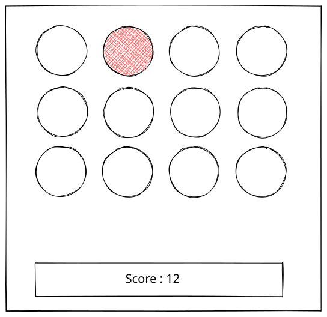

# The Whack-a-Mole

The Whack-a-Mole project was built as part of the Software Development course at BeCode, completed early in my learning journey.
It is a simple browser-based game that focuses on JavaScript fundamentals such as DOM manipulation, events, and timing functions.  

Below you’ll find the original assignment instructions, followed by a screenshot of my implementation.

## The challenge

The goal of this classic game is to “whack” moles as they randomly appear from holes on the screen.  

In this simplified version, moles are represented using basic HTML elements. The player earns points by clicking on a mole as soon as it appears.  

## Game rules:
- A mole appears randomly in one of the holes every short interval
- The player must click the mole to score a point
- Each successful click increases the score
- The game runs against a countdown timer
- When time runs out, the game ends  

### This project helped reinforce my understanding of:

- JavaScript timers (setInterval, setTimeout)
- Event handling (click interactions)
- Dynamic class manipulation
- Basic game loop logic

## Reference

Original inspiration for layout and concept:  

  
# Screenshot of the final result 

