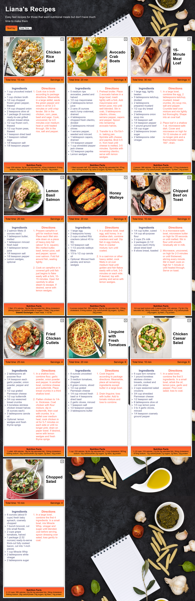
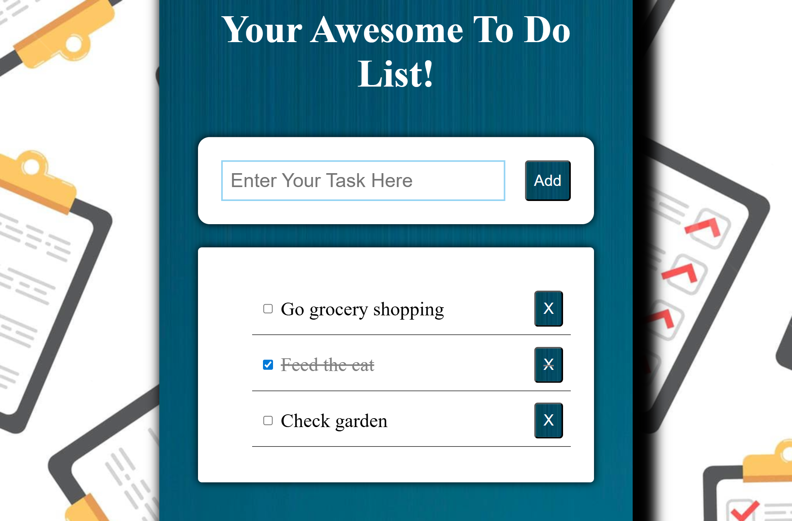
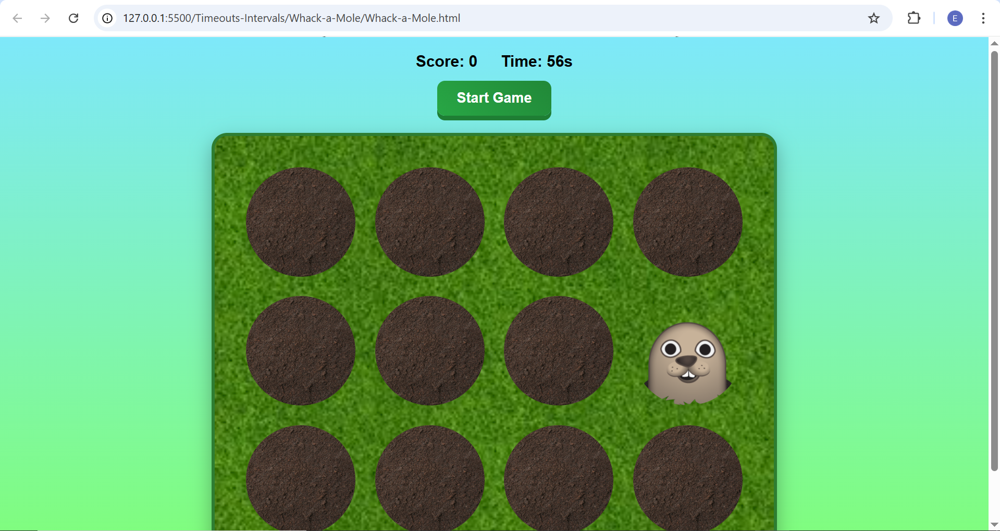

# BeCode Projects Collection

This repository contains projects I completed during the **Software Development course at BeCode**.  
These projects reflect my early progress in web development, focusing on building a solid foundation in HTML, CSS, and JavaScript.

Each project includes its own dedicated folder with a detailed `README.md`, explaining the assignment and showcasing the final result.

---

## Projects

### The Collection

A dynamic web application that displays a collection of items using JavaScript.

**Key features:**
- Data structured using arrays and objects  
- Dynamic card generation with DOM manipulation  
- Responsive layout using CSS Grid and Flexbox  
- Ability to delete items from the collection  
- Sorting functionality based on categories  

This project helped me practice working with structured data and rendering it dynamically in the browser.

#### Screenshot

---

### The To-Do List

A simple and interactive task management application.

**Key features:**
- Add, complete, and delete tasks  
- Persistent data using `localStorage`  
- Event-driven interactions  
- Clean and responsive UI  
- Structured code using JavaScript modules  

This project strengthened my understanding of DOM manipulation, event handling, and state management.

#### Screenshot

---

### The Whack-a-Mole

A fun and interactive browser game where the player must click on moles as they appear to score points before time runs out.

**Key features:**
- Random mole appearance using JavaScript timing functions
- Score tracking with real-time updates
- Countdown timer to limit gameplay duration
- Event-driven interactions (click detection on moles)
- Dynamic DOM manipulation for game state changes
- Simple animations and visual feedback using CSS

This project helped me practice working with timers, game loops, and user interaction, while reinforcing my understanding of JavaScript events and dynamic styling.

#### Screenshot

---
## Technologies Used

- HTML5  
- CSS3 (Flexbox, Grid, Responsive Design)  
- JavaScript (DOM, Events, Local Storage)

---

## About These Projects

These projects were built as part of my learning journey and demonstrate:
- My ability to translate requirements into functional web applications  
- My understanding of core front-end concepts  
- My progression from static layouts to interactive features  

---

## Additional Information

Each project folder contains:
- A detailed description of the assignment  
- The original instructions  
- Screenshots of the final result  
